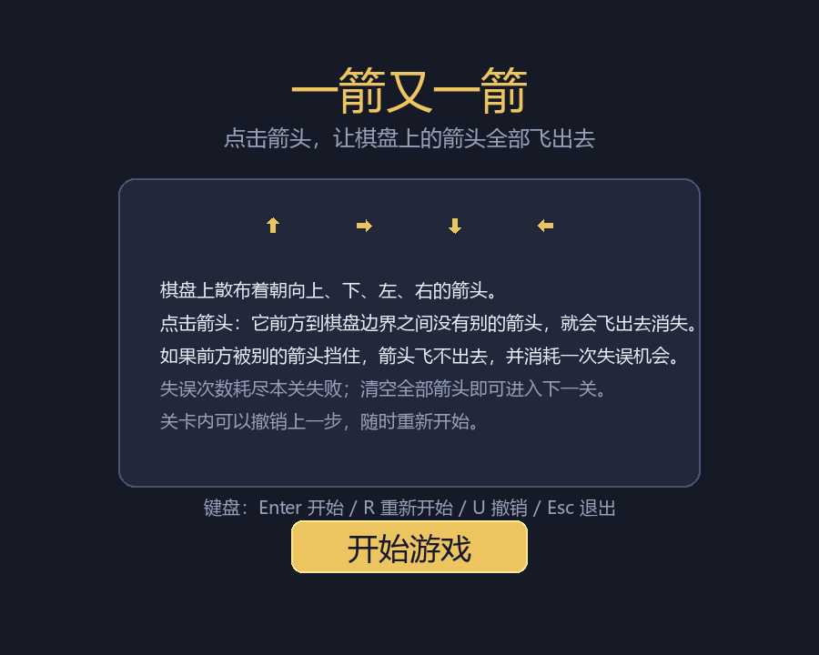
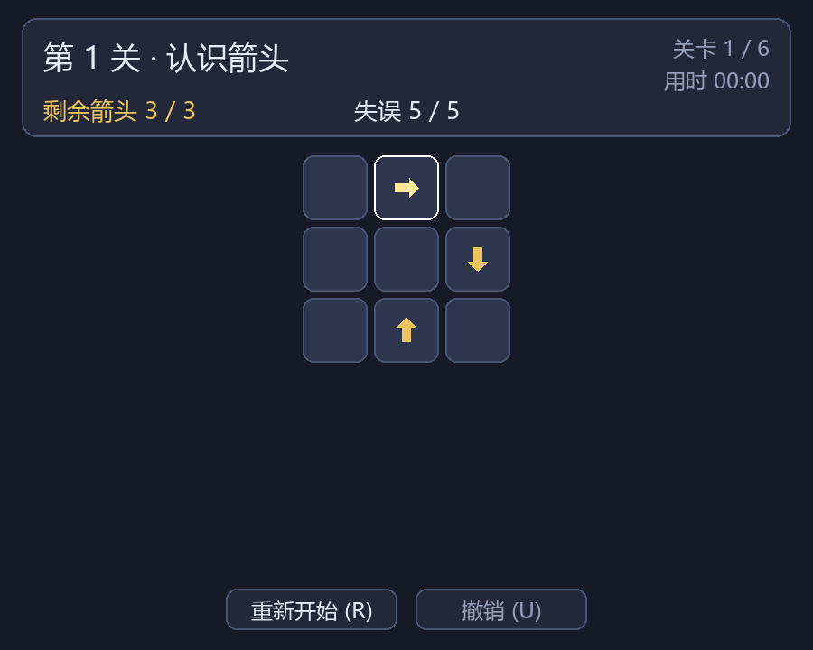
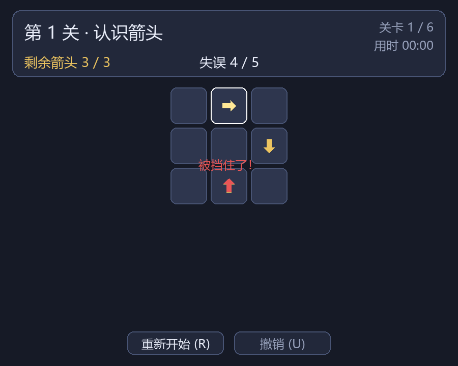
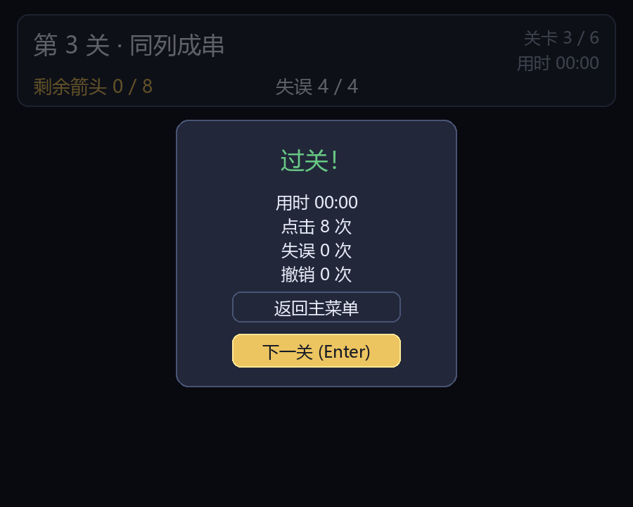
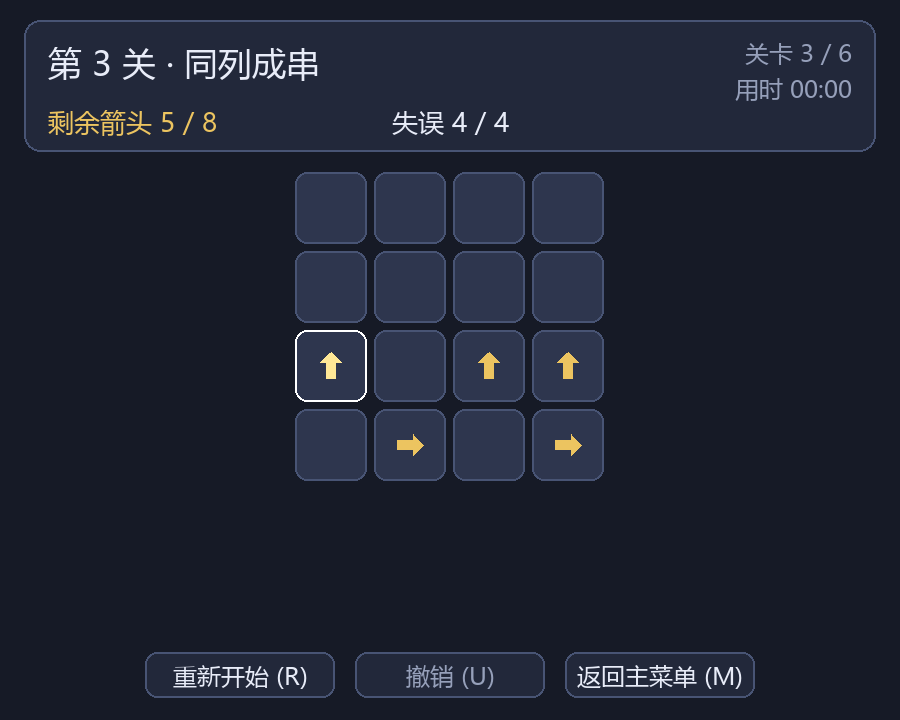
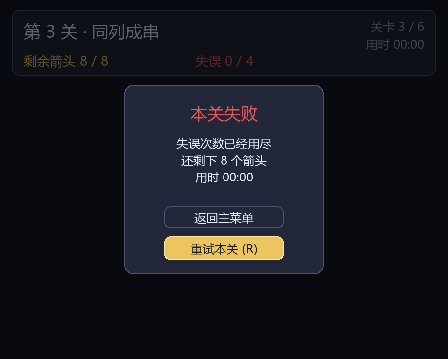
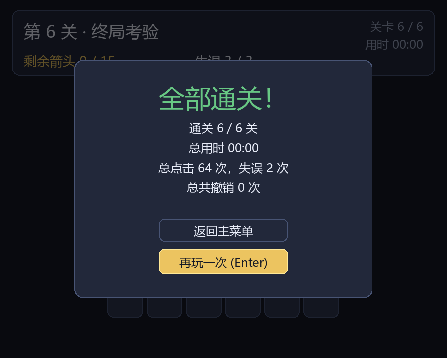

# 一箭又一箭（Arrow Arrow Game）

一个用 **Python + Pygame** 实现的箭头解谜小游戏：棋盘上散布着朝向上、下、左、右的箭头，
点击箭头，如果它前方到棋盘边界之间没有别的箭头，它就会飞出棋盘消失；如果被挡住，
箭头飞不出去并扣除一次失误。清空整关箭头即可过关，失误耗尽则本关失败。

本项目是《软件工程》课程第二次个人作业，使用 Codex 作为 AIGC 辅助工具完成，
开发过程中的 AI 协作记录见 [docs/aigc-log.md](docs/aigc-log.md)。

---

## 游戏简介

- 规则简单：只看箭头前方有没有别的箭头，没有就飞出去。
- 上手容易但要动脑：多次点击的顺序很关键，先点的箭头会为后面的箭头让路。
- 共 6 个关卡（3×3 到 6×6，合计 54 个箭头），每一关都经求解器验证存在完整通关顺序。
- 每关有失误次数上限、实时计时、可以撤销上一步、随时重新开始。

## 游戏截图

| 开始界面 | 游戏界面 |
| --- | --- |
|  |  |

| 碰撞反馈（前方被挡住） | 过关结算 |
| --- | --- |
|  |  |

| 第 3 关游戏过程 | 失败界面 |
| --- | --- |
|  |  |



## 开发环境

| 项目 | 版本 |
| --- | --- |
| 操作系统 | Windows 11 |
| Python | 3.13.12 |
| Pygame | 2.6.1 |
| 打包工具 | PyInstaller 6.22.3（可选） |

## 安装与运行

```bash
# 1. 安装依赖
pip install -r requirements.txt

# 2. 运行游戏
python main.py
```

如果 `pip` 下载缓慢，可以使用国内镜像：

```bash
pip install -r requirements.txt -i https://pypi.tuna.tsinghua.edu.cn/simple
```

## 游戏操作说明

| 操作 | 说明 |
| --- | --- |
| 鼠标左键点击箭头 | 尝试让该箭头飞出棋盘 |
| `R` | 重新开始本关（箭头布局与失误次数都会还原） |
| `U` | 撤销上一步成功消除（不消耗失误） |
| `Enter` / `Space` | 开始游戏、进入下一关、再玩一次 |
| `Esc` | 退出游戏 |

界面上的按钮同样可以完成上述操作。动画播放期间输入会被锁定，避免一次点击被重复结算。

## 关卡设计

| 关卡 | 名称 | 尺寸 | 箭头数 | 开局被挡 | 失误上限 |
| --- | --- | --- | --- | --- | --- |
| 1 | 认识箭头 | 3×3 | 3 | 1 | 5 |
| 2 | 错身而过 | 4×4 | 6 | 4 | 4 |
| 3 | 同列成串 | 4×4 | 8 | 6 | 4 |
| 4 | 层层叠叠 | 5×5 | 10 | 8 | 3 |
| 5 | 交错迷阵 | 5×5 | 12 | 8 | 3 |
| 6 | 终局考验 | 6×6 | 15 | 11 | 3 |

关卡数据写在 `game/levels.py` 里，用等长字符串描述，`.` 表示空格，`^ v < >` 表示四种箭头：

```python
Level(
    name="第 1 关 · 认识箭头",
    grid=(
        ".>.",
        "..v",
        ".^.",
    ),
    mistakes=5,
)
```

想自己加关卡，只要往 `LEVELS` 里追加一条，然后运行 `python tools/level_stats.py`
确认它确实可以通关即可。

## 目录结构

```text
.
├── main.py                     # 程序入口
├── requirements.txt            # 依赖（只有 pygame）
├── game/
│   ├── config.py               # 窗口尺寸、配色、字体与动画参数
│   ├── direction.py            # 四种方向及其网格位移
│   ├── board.py                # 棋盘与路径检测（核心逻辑）
│   ├── levels.py               # 6 个关卡的数据
│   ├── solver.py               # 求解器：判断可解并给出通关顺序
│   ├── session.py              # 游戏流程状态机：失误、计时、撤销
│   ├── app.py                  # pygame 主循环
│   └── ui/                     # 布局、箭头绘制、控件、动画、界面
├── tests/                      # 标准库 unittest 自动化测试
├── tools/
│   ├── generate_levels.py      # 关卡布局生成器（逆向摆放保证可解）
│   ├── level_stats.py          # 关卡统计
│   ├── capture_screens.py      # 离屏渲染生成截图
│   └── build_exe.py            # 打包成 exe
└── docs/
    ├── aigc-log.md             # AIGC 使用过程记录
    ├── test-record.md          # 测试记录（T01–T06 等）
    └── screenshots/            # README 与博客用的截图
```

## 实现要点：路径检测

判断箭头能不能飞出，就是看它到棋盘边界之间有没有别的箭头。用带边界判断的循环逐步前进：

```python
def is_free(self, row, col) -> bool:
    direction = self.at(row, col)
    if direction is None:
        return False
    d_row, d_col = direction.delta
    cur_row, cur_col = row + d_row, col + d_col
    while self.inside(cur_row, cur_col):   # 越界即视为畅通
        if self._cells[cur_row][cur_col] is not None:
            return False
        cur_row += d_row
        cur_col += d_col
    return True
```

这里必须显式判断边界：如果偷懒写成 `self._cells[row - 1][col]`，Python 的负索引会让
「向上检测」跑到棋盘最下面一行去，把棋盘底部的箭头误判成阻挡——`tests/test_board.py`
里的 `test_negative_index_wraparound_regression` 就是针对这个坑的回归用例。

## 测试

```bash
python -m unittest discover -s tests -t . -v
```

共 58 个用例，覆盖路径检测（四种方向、边界、负索引回归）、关卡数据合法性、
每个关卡可通关、失误与撤销、计时、以及界面层的事件与渲染冒烟测试。
详细的测试记录见 [docs/test-record.md](docs/test-record.md)。

## 生成截图

```bash
python tools/capture_screens.py
```

使用 SDL 的 dummy 视频驱动离屏渲染，不需要显示器，也不需要人工操作，
输出到 `docs/screenshots/`。

## 打包成可执行文件

```bash
pip install pyinstaller
python tools/build_exe.py
```

生成 `dist/ArrowArrowGame.exe`，双击即可运行，无需安装 Python。

## 素材来源说明

- 游戏中的所有图形（棋盘、箭头、按钮、界面）都由程序用 Pygame 绘制，没有使用任何
  外部图片素材。
- 界面字体使用 Windows 自带的中文字体（微软雅黑 / 黑体 / 宋体），按顺序自动回退；
  如果系统没有这些字体，会退回到 Pygame 默认字体，中文可能显示为方块。
- 关卡布局由 `tools/generate_levels.py` 生成候选后人工筛选，玩法灵感来自微信小游戏
  《一箭又一箭》，未使用其任何代码、素材或关卡。